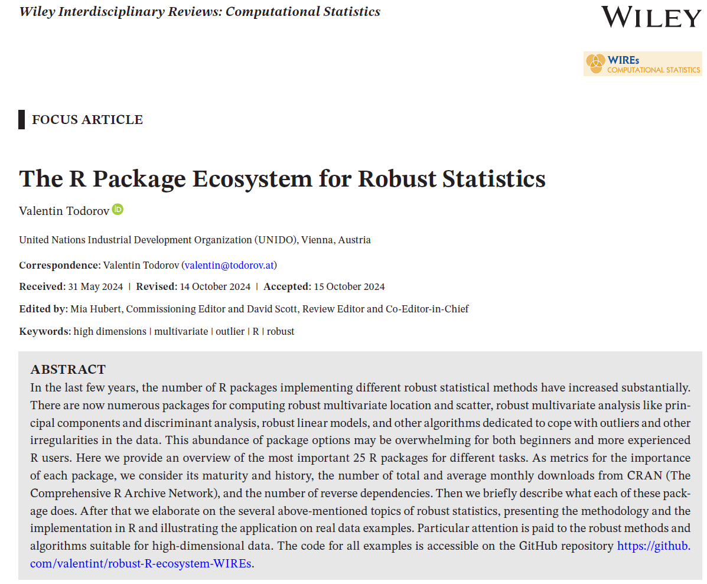

<!-- README.md is generated from README.Rmd. Please edit that file -->

# robust-R-ecosystem-WIREs

**Replication scripts for the paper [“The R Package Ecosystem for Robust
Statistics”](https://doi.org/10.1002/wics.70007)**

 
```{r, echo=FALSE, out.width = "60%"}
##
```

### The `Data` directory

Contains the input data files and several intermediate files crieted by
the R scripts.

### The `Output` directory

Here will be stored the output PDF files of the Figures.

### The `R` scripts

To run the scripts start `R` in the current directory - this will set it
as the current working directory. Throughout all scripts the package
**here** is used which helps with easy file referencing and building
file paths. At the beginning of each script is called
`here::i_am("ScriptFileName.R")` and then input files are read from
`here::here("Data", InputFileName)` and output files (Figures) are
written to `here::here("Output", "OutputFigureFile.pdf")`.

The package **conflicted** is used to avoid conflicts of function names
in different packages (e.g. `plyr::here()` and `here::here()`).

1.  `R-ranking.R`: Figure 1. Ranking of R popularity according to PYPL
    and TIOBE indexes. Reads the rankings from the Excel file
    `R-ranking.xlsx` (or alternatively from the two CSV files
    `R-ranking-PYPL.csv` and `R-ranking-TIOBE.csv`) and presents the
    rankings as circular diagram. The two diagrams are joined together
    in a figure using the function `grid.arrange()` and are stored into
    the output file `R-ranking.pdf`.

2.  `downloads2.R`: Figures 2 and 3. Using th function `findPackage()`
    from package **packagefinder** a list of packages ob CRAN is created
    containing specific keywords in their title and description
    (e.g. *robust*, *outlier*, etc). From this listare removed some
    clearly nonrelevant packages (e.g. **jsonlite**, **rprojroot**,
    **RCurl**) and are added some packages which we are interested in
    but do not contain the given words (**VIM**, **cluster**,
    **chemometrics**). For the packages in the obtained final list the
    downloads information from (<http://cran-logs.rstudio.com/>) is
    retrieved. For this purpose is used the function `cran_downloads()`
    from the package **cranlogs**. The retrieved data are stored in the
    intermediate file `downloads.rda`. The top 15 packages by total
    number of downloads and by number of montly downloads are presented
    in two bar charts - the left and right panel of Figure 2. The
    monthly data of the top 5 packages are presented as line chart in
    Figure 3.

- Figure 2: Top 15 R packages for robust statistics by total downloads
  in millions (left-hand panel) and average monthly downloads (K/month)
  (right-hand panel) from October 2012 to April 2024. Source of data:
  (<http://cran-logs.rstudio.com/>).

- Figure 3: Monthly downloads of the Top 5 R packages for robust
  statistics in the period October 2012 to April 2024. Source of data:
  <http://cran-logs.rstudio.com/>.

3.  `intro-bushfire.R`: Figures 4 and 5. We illustrate the effect of
    outliers on classical location and covariance estimates and the
    performance of the corresponding robust estimates with a small
    multivariate example with 38 observations in 5 variables. The data
    set bushfire from the package **robustbase** contains the well known
    data set used by Campbell (1984) to locate bushfire scars. The data
    set contains satellite measurements on five frequency bands,
    corresponding to each of 38 pixels. It was introduced in the
    robustness literature by Maronna and Yohai (1995) while studying the
    properties of the Stahel-Donoho robust estimator. They identified 14
    outliers: cases 8 and 9 are outstanding and are followed by a
    cluster of outliers 32-38. Next come 7, 10 and 11 and finally 31
    and 12. The 14 outliers do not show up in the box plots in the
    left-hand panel of Figure 4 but they are clearly seen in several of
    the scatter plots shown in the right-hand panel which shows that
    they are not univariate outliers and cannot be identified by
    investigating any of the coordinates separately. For the right-hand
    panel of Figure 4 the function `ggpairs()` from the package
    **GGally**, customized accordingly, is used.

- Figure 4: Box plots (left) and pairwise scatter plots (right) for the
  bushfire data set. The 14 known outliers are marked in red in the
  right-hand panel.

- Figure 5: Classical and robust correlations and tolerance ellipses
  (left) and classical and robust Mahalanobis distances (right) for the
  bushfire data.

4.  `ex-glass-1.R`: Figures 6 and 7. In this example we consider a data
    set of EPXMA spectra over $p = 750$ wavelengths collected on 180
    different archeological glass vessels (Hubert et al., 2005; Maronna
    and Yohai, 2017). The data are available in the package **rospca**
    as the data set `Glass`.

- Figure 6: Glass data set: Robust principal component analysis (PCA) of
  a subset of the data. Two groups of outliers are identified.

- Figure 7: Glass data: $\chi^2$ QQ-plots of squared Mahalanobis
  distances of estimates (square root of the quantiles of the $\chi^2$
  distribution on the X-axis).

5.  `ex-bwheel.R`: Figures 8 and 9 and Table 3. First an example date
    set is generated using the function `rbwheel()` from the package
    **robustX** and it is presented in a matrix of scatterplots using
    the function `ggpairs()` from the package **GGally**. Then a list of
    the methods used in the simulation is presented in Table 3 - with
    package name, funcion name and brief description. Using the function
    `xtable()` the necessary Latex is generated. The simlation is
    conducted and the results are stored in the file `bench_bwheel.rda`.
    These results are used to create Figure 9.

- Figure 8: Scatter plot matrices of a sample from the barrow wheel
  distribution, $p = 4$

- Figure 9: Simulation results for 100 repetitions with
  $n = 25, p = 5, \epsilon = 0.2$ of the “barrow wheel” distribution.
  The oracle function is the sample covariance for the clean data.

- Table 3: Robust estimators available in R which are compared in the
  simulation.

6.  `ex-glass-2-MRCD.R`: Figure 10 and Graphical abstract. Now we turn
    again to the complete `Glass` data set and take the first 500
    frequencies. From other studies it is known that the window of the
    detector system was cleaned before the last 38 spectra were measured
    and as a result less radiation was absorbed, hence more was
    detected - these observations are 143-179. Then, 57-63 and 74-76 are
    samples with a large concentration of calcium; 22, 23 and 30 as well
    as 180 are border cases. With a data set $180 \times 500$ we cannot
    apply any of the algorithms but the MRCD. Since the first step in
    MRCD is robust standardization of the data, let us remove the
    variables with zero median absolute deviation (MAD) (there are 13
    such variables). Then we compute the regularized MCD (MRCD)
    estimator and present the distance-distance plot in the left-hand
    panel of Figure 10. Some of the outliers are identified also by the
    classical Mahalanobis distance but only the MRCD based robust
    distance identifies the large group of outliers (shown in red).
    There are also some regular observations which are marked as
    outliers. In the right-hand panel is shown for comparison the
    diagnostic plot of the robust principal component analysis (ROBPCA).

- Figure 10: Glass data: Distance-distance plot obtained with the MRCD
  estimator in the left-hand panel and distance-distance plot obtained
  with robust PCA (ROBPCA) in the right-hand panel. The regular
  observations are shown in blue, the 38 outliers 143-179, the outliers
  57-63 and 74-76 and the border cases 22, 23, 30 and 180 - in red.

7.  `ex-pca.R`: Figure 11. The following example illustrates the effect
    of outliers on classical PCA. We generate a data set of $n = 60$
    observations of two variables $x_1$ and $x_2$ from a bivariate
    normal distribution with zero means, variances of 1, and a
    correlation between the two variables 0.8. The sample correlation of
    the generated data set is 0.75. We sort the data by the first
    coordinate x1 and modify the first four observations with smallest
    x1 and the last four with largest $x_1$ by interchanging their first
    coordinates. Thus (less than) 15% of outliers are introduced which
    are undistinguishable on the univariate plots of the data. However,
    the sample correlation even changes its sign and becomes -0.002.

- Figure 11: Plot of the principal components of the generated data: the
  upper two panels show scatter plots of the clean (left-hand panel) and
  the altered (right-hand panel) data with the first principal
  component. The lower two panels show plots of the scores obtained by
  classical (left-hand panel) and robust (right-hand panel) PCA together
  with the corresponding 97.5% tolerance ellipses.

8.  `ex_pca-Table-4.R`: Table 4. Creates a list of the PCA methods
    considered in the paper which is presented in Table 3 - with package
    name, funcion name and brief description. Using the function
    `xtable()` the necessary Latex is generated.

9.  `ex-pca-kibler.R`: Figures 12, 13 and 14. First the data are
    prepared using the data set `kibler` from the package **rrcovHD**.
    This data set contains a data frame `kibler_orig` with the original
    data, with the variables `make` and `fuel-type`. We will keep only
    the continuous variables nd will remove the observations with
    missing values. From the variable `fuel-type` we get the information
    about which cars are with diesel engines - these will be our
    outliers. The obtained data is saved in the file `kibler.rda`.

- Figure 12: Plots of the first two PCA scores for classical PCA, robust
  PCA based on MM-estimate of the covariance matrix, robust PCA based on
  projection pursuit and the ROBCA algorithm. The marked observations
  are the cars with diesel engines.

- Figure 13: Diagnostic plots for classical PCA, robust PCA based on
  MM-estimate of the covariance matrix, robust PCA based on projection
  pursuit and the ROBCA algorithm. The marked observations are the cars
  with diesel engines.

- Figure 14: Scaled outlier maps of standard PCA, SCOTLASS (with
  $\lambda = 1.48$), ROBPCA (non-sparse), ROSPCA (with
  $\lambda = 1.075$), SRPCA (with $\lambda = 3.09$) and LTSSPCA on the
  kibler data. The marked observations are the cars with diesel engines.

- Table XXX (not shown in the paper): Number of non-zero loadings
  (larger than 1e-5) for the kibler data for each method per PC. The PS
  row shows the number variables in the PC subspace. The last row shows
  the number of variables that were excluded form the model (i.e. have
  zero loadings on all 4 PCs)

9.  `ex-simple-regression.R`: Figure 15. We create artificial data based
    on the data set `starsCYG` from the package **robustbase** adding
    outliers of all types.

- Figure 15: Simple linear regression: scatter plot with outliers (in
  red), classical least squares line (red) and robust (LTS) line (blue)
  in the left-hand panel; standardized robust residuals of y versus
  robust distances of X in the right-hand panel.

10. `ex_wood-regression.R`: Figure 16 and Table 5. The data set `wood`
    from the package **robustbase** contains the well known modified
    wood specific gravity data set from Rousseeuw and Leroy (1987, Table
    8, page 243). The raw data are from Draper and Smith (1966, p. 227)
    and were used to determine the influence of anatomical factors of
    wood specific gravity with five explanatory variables and an
    intercept. A contaminated version of the data set was created by
    replacing a few (four) observations by outliers: 4, 6, 8 and 19.

- Figure 16: Modified data on wood specific gravity: OLS regression
  diagnostic plot in the left-hand panel and the robust version obtained
  with the LTS in the right-hand panel.

- Table 5: Modified data on wood specific gravity: Standard regression
  output of LTS estimation.

11. `ex_ttdi2024.R`: Figures 17, 18 and 19 and Table 6. The data are
    read from the original Excel file `WEF_TTDI_2024_edition_data.xlsx`,
    transformed and written to a CSV file: `ttdi2024.csv`. At the same
    time is created a file `ttdi2024-pillars.csv` containing the names
    of the variables to be considered. These are used to create Table 6.

- Table 6: List of the 17 pillars of the Travel and Development Index
  2024 of the World Economic Forum. The response variable is TSI -
  Tourist Services and Infrastructure and the regressors are the rest 16
  pillars.

- Figure 17: Travel and tourism development index data 2024: Left-hand
  panel: Coefficient path for the sparse LTS, plotted versus the penalty
  parameter $\lambda$ and right-hand panel: cross-validated estimate of
  the robust root mean-squared prediction error for sparse LTS together
  with upper and lower standard deviation curves, as a function of the
  penalty parameter λ (on a log scale). The value of $\lambda$ which
  gives the minimal RTMSPE and the largest value of $\lambda$ such that
  the error is within one standard error of the minimum are indicated by
  vertical dotted lines.

- Figure 18: Travel and tourism development index data 2024: Robust
  regression diagnostic plots with 7 non-zero coefficients. Left-hand
  panel: normal QQ-plot of the standardized residuals against the
  quantiles of the standard normal distribution; Right-hand panel:
  standardized residuals against robust Mahalanobis distances.

- Figure 19: Travel and tourism development index data 2024: Robust
  regression diagnostic plots with 7 non-zero coefficients. Left-hand
  panel: Index plot of the residuals; Right-hand panel: plot of the
  residuals vs.  fitted values.

12. `ex-psifun-robustbase.R`: Not in the paper.

- Figure XXX: Robust $\rho-$ and $\psi-$functions: Huber family of
  functions using tuning parameter $k = 1.345$ in the left-hand panel
  and Bisquare family functions using tuning parameter $k = 4.685$ in
  the right-hand panel. This figure was created using the code provided
  in the package **robustbase**.
